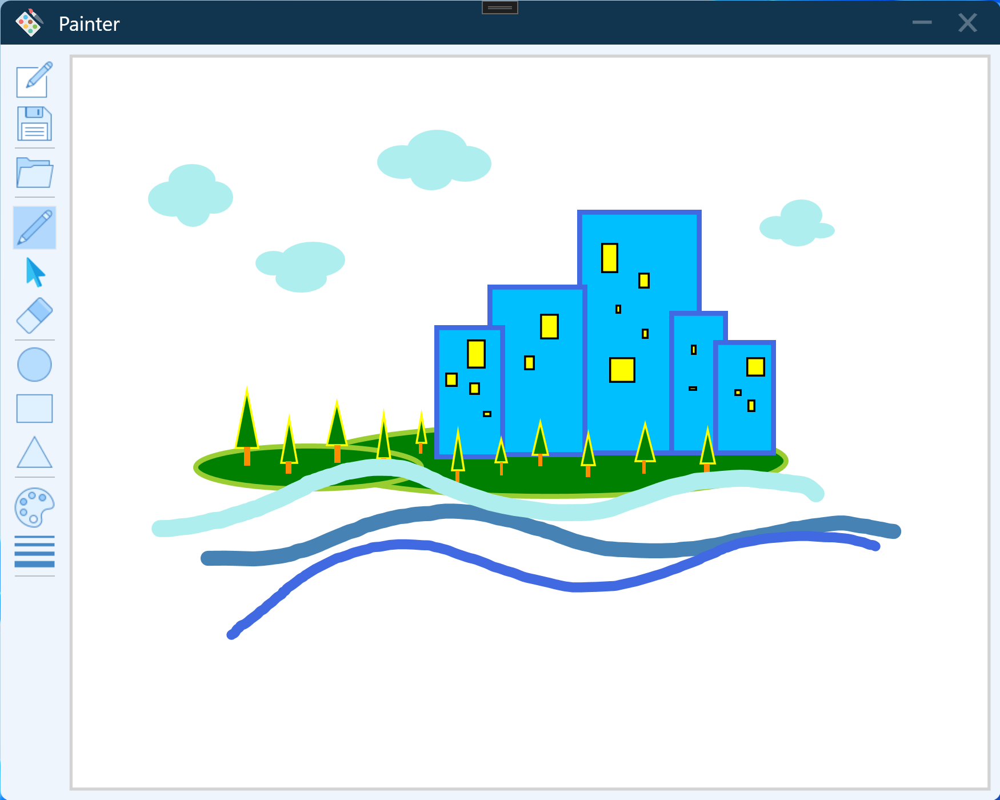

# Painter
#### Just a simple drawing application (C#, WPF)

### Features
- MVVM structure
- Recreate a brand-new canvas.
- Save all manipulation into *.paint file (JSON-format-like).
- Load existing *.paint file (JSON-format-like).
- Draw stroke on canvas like using pen.
- Create a shape (Rectangle, Ellipse, and Triangle).
- Select and change the position of items (strokes and shapes) on canvas. 
- Change stroke weight and color.
- Change shape's border width and color and change shape's filled color.
- Resize stroke and shape.
- Erase stroke and shape.

### Help
- ~Triangle-resizing feature has some offset problem, and not work properly at this moment.~ (Bug fixed. Thank [`@Bocin-Chen`](https://github.com/Bocin-Chen) for sharing his advice with me.)

### Demo

## Authors
Roger Lo
[turkeyworld64@gmail.com](mailto:turkeyworld64@gmail.com?subject=Project:Painter)
